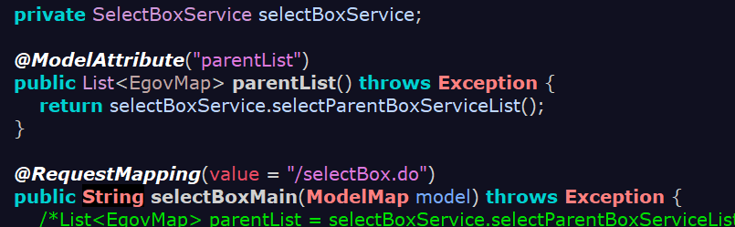
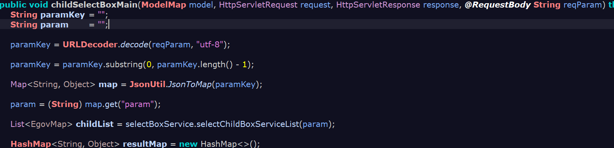
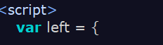
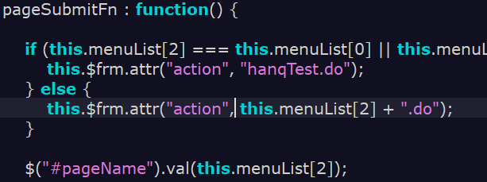
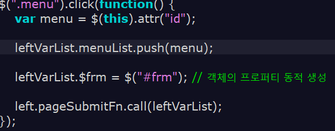

# 02-17

---

AJAX는 톰캣을 거치지 않는다.

ajax get방식일 때는 한글 처리를 response에 해줘야한다.

out.write (response)로 메세지 컨버터에 내려주기

get 방식

매개변수명을 잘 짓자!

호출메서드 위에는 항상 주석을 습관화 하자!

해당 값이 null이고 object 일 때 << 널 체크

length처럼 안전한 것도 없다.

$("#~~") 아이디는 직접 선택자

append 는 해당 타겟에 자식요소 중에서도 맨 밑에 넣는다.

prepend

호이스팅 때문에 항상 변수는 맨 위에다 적어야 한다.

@RequestBody 바디 쪽에 있는 문자열을 그대로 받아온다

렉시컬 스코프

컨텍스트

클래스

오브젝트

a();를 호출 할 때 유효범위체인이 만들어 진다.

this는 호출 함수가 결정 하는 것이다.

제이쿼리는 메모리 낭비가 심하기 때문에 var 에 넣어줘야 한다.

그리고 변수 앞에 $를 붙여서 표시한다.

call 함수!!

전역변수는 window 컨텍스트의 프로퍼티가 되는 것이다.

기본바인딩

Undefined는 무언가를 가르켰는데, 가르 킨 곳에 아무것도 없으면 뜨는 것 이다.