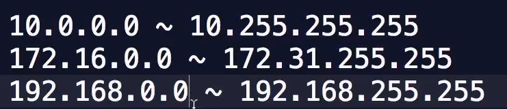

# Code-Flow

---

- **운영체제**

    **운영체제는 단순히 하나의 프로그램이고, 주변기기들을 제어하고 또한**

    **응용 프로그램을 실행하고 만들 때 쓸 수 있는 다양한 API를 제공한다.**

    **프로그램은 운영체제에 종속적이다!**

## **프로그램**

- **기계어(명령어)**

<**CPU 아키텍쳐**> 이런 기계어와 기능을 맵핑 한 것

- **어셈블리어**

add는 0x000000FF

sub는 0x000000FE

- **프로그래밍 언어**

사람이 이해하기 쉽게, 문맥적인 의미를 제공

이때! 프로그래밍 언어는 작성된 <소스코드는 단순한 텍스트> 파일

<컴파일> → 번역하는 과정

텍스트 파일→어셈블리어→기계어

**!!! 컴파일된 파일은 운영체제의 종속적이고, <CPU의 아키텍쳐>의 종속적이다.**

- **POSIX**

서로 다른 유닉스 OS의 공통 API를 정리하여 이식성이 높은 유닉스 응용 프로그램을 개발하기 위한 목적으로 만든 인터페이스 규격

프로그램 → 운영체제의 실행 → 프로세스

- **Stack**

함수가 실행되는 공간

- **Heap**

동적으로 데이터가 할당되고 데이터가 변경되는 공간

- 아키텍쳐, 명령어 집합

CPU가 처리 할 수 있는 단순한 명령어들의 집합으로 하드웨어 수준에서 설계 됨

- 소스코드

    사람이 이해하기 쉬운 프로그래밍 언어로 프로그램의 작동을 묘사한 텍스트 파일

- 컴파일,컴파일러

    소스코드를 기계어로 번역하는 과정, 그리고 번역을 담당하는 프로그램

- 프로그램

    운영체제와 CPU에 종속적인 실행 가능한 파일

- 프로세스

    운영체제가 메모리에 프로그램을 복사하여 CPU가 처리중인 프로그램

## GUI , CLI

---

**GUI** → Graphical User Interface

**CLI** → Command Line Interface

입력과 출력이 오로지 텍스트만으로 이루어 진다.

- 왜 CLI라는 것을 써야하냐?
    - 먼저 개발자용 프로그램이나 내부적인 시스템 프로그램 등은 대부분이 CLI 프로그램으로 이루어져 있는 경우가 많다.
    - 가볍고 빠르다.
    - 원격으로 조작하기에 용이하다 (I/O)

**GU**I와 **CLI**는 본질적으로는 큰 차이가 없는 프로그램이다.

---

- Shell

    운영체제의 기능을 이용하고, **프로그램을 실행하기위한 Shell**

    커널과 유저를 이어주는 쉘

    - GUI Shell
    - CLI Shell

    - 왜 LINUX?
        - 튼튼하고 신뢰성있는 운영체제
        - 다양한 플랫폼의 이식성
        - 네트워크에서 뛰어난 성능 (서버로 많이 사용)
        - 개발자들의 요람
        - 그럼에도 무료 (오픈소스)

- Shell 명령어

    / 최상위 폴더를 의미

    ~ Home 폴더를 의미

    **. 현재 폴더**

    **.. 해당 위치에서의 상위 폴더**

    pwd

    ls -al

    cd 폴더명

    mkdir

    rm 파일삭제

    rm -rf 폴더 삭제

    rm은 휴지통으로 가서 복원할 방법이 없어서 아주 조심히 다루어야 한다.

    touch

    와일드카드

    mv

    cp 

    cat  

    chmod 파일 권한 관리

- 환경변수
    - 운영체제에서 관리하는 일련의 값들
    - $PATH

- 파일 권한

    단일 머신에서 사용자간의 파일 영역을 분리

    또한 파일들의 실행 권환에 대한 제어하는 등 보안 이슈와 직결

    - read, write, execute → 권한의 종류
    - -r, -w, -e

    - 권한이 적용되는 종류

    user, group, others

    - 권한의 표기

    각각의 권한주체들의 합 

루트 유저 - 최고 관리자 

sudo 관리자의 권한이 임시적으로 필요할 때 쓰는 명령어

Permission denied

**통신은 호스트의 프로세스 간에 이루어 진다!**

- 프로세스

 + 호스트 상에서 프로세스를 구분하기 위한 표식 <포트 번호>

- 호스트

 + 네트워크 안에서 호스트를 구분하기 위한 표식 <아이피 주소>

- 네트워크 장치, 이더넷, 와이파이, 블루투스 등의 NIC

 + Mac Address

- 사설망 IP

    

- 프로토콜 (통신규약)
    - 저수준 프로토콜 IP, TCP/UDP

    - 응용 프로토콜

        원격으로 집안의 전등을 켜고 끄는 서버와 스마트폰 클라이언트 앱의 통신규약

# 2장

---

<스크립트 언어>

- 소스코드(텍스트 파일) → **실행시** 컴파일 / 인터프리터
- NodeJs/JavaScript, 파이썬, PHP, Ruby 등등

- NodeJs 인터프리터 (CLI 프로그램)
- 내장된 API를 위한 라이브러리 파일들
- NPM node package manager