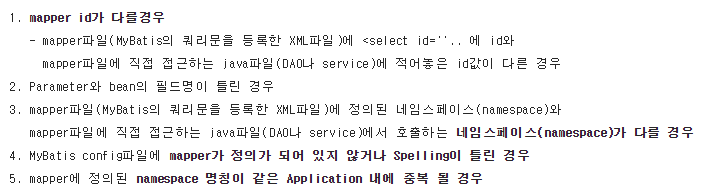
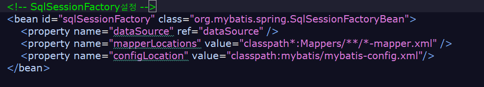
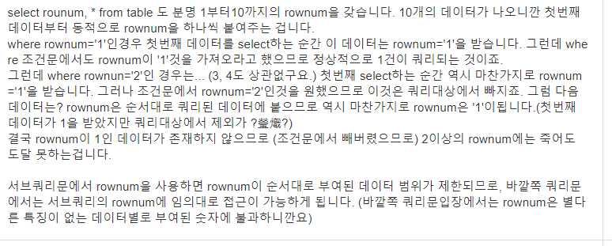
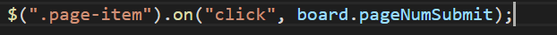
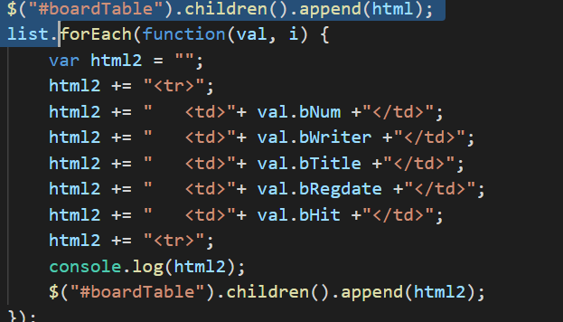
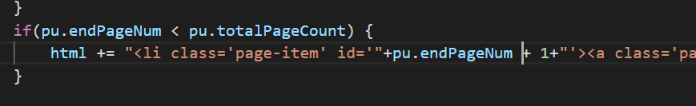
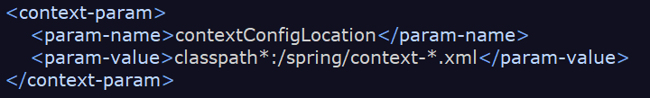

# 트러블슈팅

- **<include refid="selectColumn"/>** 는 **<![CDATA[ ]]** 안에 들어가면 안먹는다!
- INSERT 에서 AS를 사용할 필요가 없는데 사용해서 에러
- **Mapped Statements collection does not contain value for**

    

    이 대부분 나같은 경우엔

    

    해당 mapperLocation 프로퍼티에 밸류 경로에 오타가 있었다.

- select * from (select * from board order by b_num asc) where rownum >= 1; 은작동되는데

    select * from (select * from board order by b_num asc) where rownum >= 2; 에서 데이터를 못불러온다.

    >>

    

- on("click", 콜백함수); 에서 콜백함수에는 함수 명만 적어주면 된다!

    

- A bad HTTP response code (404) was received when fetching the script

    서비스워커 관련 에러!

- 이런식으로 html 태그를 클로징하는걸 실수로 잘못 쳤더니

    알아서 append 해준후에 브라우저가 태그를 닫아준다 !

    

- 동적으로 생성된 태그에 이벤트를 등록하고 싶을 때

    $(document).on("click","타겟태그",function() { } );

- json으로 받아 온 값들은 모두 string이기 때문에 연산할 때 주의!

    

- map에서 get(key)로 값 꺼내 온 후 (String)을 붙여 강제 형변환하려는데 오류가 뜸

    Integer는 String으로 강제 형변환 안된다는 에러가 뜸.

    map에서 꺼내면 무조껀 Object 가져오는 줄 알았는데..

- LifecycleProcessor not initialized - call 'refresh' before invoking lifecycle methods

    

    이 부분에 classpath*: 를 추가한 후 실행이 된다.

    classpath*:가 없을 경우는 현재 프로젝트의 해당하는 경로의 리소스만 해당하기 때문에

    java,resources,webapp 중에 resources에 있는걸 서치하지 못했던 것 같다.!!