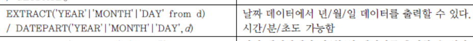
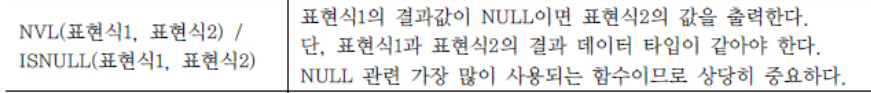
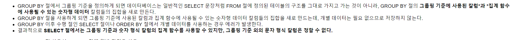

# DataBase (ORACLE)

---

- DDL
    - 데이터베이스 객체의 구조를 정의합니다.
    - CREATE, ALTER, DROP
- DML
    - 데이터의 삽입,삭제,갱신등의 처리
    - INSERT, DELETE, UPDATE
- DCL
    - GRANT 데이터 베이스 객체의 권한 부여
    - REVOKE 이미 부여된 권한 취소

# 알아둬야 하는 키워드들

- ||

    합성연산자

- BETWEEN 연산자
- IN 연산자
- LIKE 연산자
- IS NULL

    ex) where aaa = null 이런식으로 사용하면 안된다.

    where aaa is null << 맞는 방법

- 논리연산자
    - AND, OR, NOT
- ROWNUM

    SQL 처리 결과 집합의 각 행에 대해 임시로 부여되는 일련번호

- 단일행 함수
    - 여러 인자를 입력해도, 단 하나의 결과만 리턴한다.
    - 각 행들에 대해 개별적으로 적용하여 데이터 값들을 조작하고, 각각의 행에 대한 조작 결과를 리턴한다.
    1. LOWER(문자열), UPPER(문자열)
    2. CONCAT(문자열, 문자열)
    3. SUBSTR(문자열, m[, n])
    4. LENGTH(문자열) - 문자열의 길이를 반환한다.
    5. LTRIM, RTRIM, TRIM

    ## 날짜 함수

     6. 유용해보임

    

- NVL , ISNULL

    

## 집계 함수 (여러 행들을 그룹화해서 그룹당 하나의 결과값을 리턴하는 함수)

---

1. count(*) , count(표현식)
2. SUM(표현식)
3. AVG(표현식)
4. MAX() , MIN()

Group by 절과 Having 절

---

## SELECT 문장 실행 순서

---

1. FROM ( 발췌 대상 테이블을 참조 )
2. WHERE ( 발췌 대상이 아닌 것은 제거한다 )
3. GROUP BY ( 행들을 소그룹화 한다 )
4. HAVING ( 그룹핑된 값의 조건에 맞는 것만을 출력한다 )
5. SELECT ( 데이터 값을 출력/계산 한다 )
6. ORDER BY ( 데이터를 정렬한다 )

ORDER BY

---

SELECT 절에 없는 컬럼을 ORDER BY절에 사용 가능하다.

GROUP BY

---

# UNION

---

1. UNION  : 두 테이블의 결합을 나타내며, 결합시키는 두 테이블의 중복되지 않는 값들을 반환한다.

    중복을 제거하기 위해 불가피하게 SORT 함

    자료가 많거나 INDEX가 되어있지 않는 칼럼을 대상으로 하면 쿼리시간이 길어질 수 있음

2. UNION ALL : 두 테이블의 중복되는 값까지 반환한다.

- UNION 사용시 항상 컬럼별 데이터 타입이 같아야하고 컬럼의 갯수도 같아야 한다!

- Index의 정의

    1) 조회속도를 향상시키기 위한 데이터베이스 기술

    2) 색인이라는 뜻으로 해당 테이블의 조회결과를 빠르게 하기 위해 사용

    - 테이블을 생성하고 컬럼을 만든 후 데이터를 삽입하면 하나의 ROW가 생성되며

        이 ROW는 절대적인 주소 ROWID 를 갖는다.

    - DML명령을 사용 할때는 원본 TABLE은 물론 INDEX TABLE에도 데이타를 갱신시켜 주어야 하기 때문에 속도가 느려진다는 단점이 있다.
- UNION 의 DISTINCT 기준은 SELECT 해서 가져오는 튜플의 모든 필드가 중복 체크의 기준

# DB책 이것저것

---

- 문자 함수
    - INITCAP() 입력 값의 첫 글자만 대문자로 변환
    - LENGTH()
    - SUBSTR()
    - INSTR()
    - LPAD()
    - RPAD()
    - LTRIM()
    - RTRIM()
    - REPLACE()
- 숫자 함수
    - ROUND()
    - TRUNK()
    - MOD()
    - CEIL()
    - FLOOR()
    - POWER()