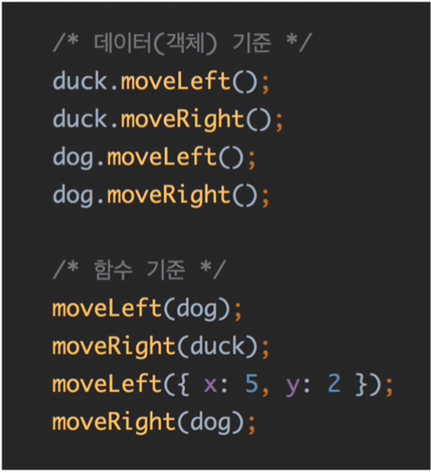
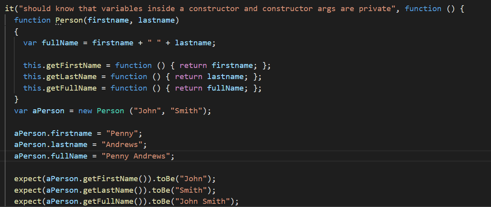

# 12월 셋째주

---

- 함수형 프로그래밍 이란?
    - 함수형 프로그래밍이란 함수를 만들어놓고 데이터를 그에 맞게 구성해 넣어서 동작시키는 것

        

- 자바스크립트에서 null과 undefined를 제외한 모든 것들은 객체처럼 동작한다.

        false.toString(); // 'false'
        [1, 2, 3].toString(); // '1,2,3'
        function Foo(){}
        Foo.bar = 1;
        Foo.bar; // 1

- 객체 리터럴인 Object Notation ( {} ) 로 객체를 생성하면 0000을 상속받는다.

    Object.prototype

- 객체의 프로퍼티를 삭제하는 방법

    delete 연산자

## 상속

---

- `function Person(name) { [this.name](http://this.name) }`

    Person.prototype.abc = function() { return 'a'; }

    자바스크립트 객체는 기본적으로 prototype이라는 속성을 가진다.

## prototype

---

- prototype  역할?

    객체와 객체를 연결하는 체인의 역할을 하는것 이다.

## 이 전의 자바스크립트 Review

---

- Array 타입을 Check 하는 방법?

    `arr.constructor === Array // true`

    `arr instanceof Array // ture`

- 유효성 체크의 순서를 꼭 생각하자!

- 자바스크립트의 break; 대용 함수?

    some()을 이용해서 break;를 대신할 수 있다. 

- 클로져란?

    외부함수가 소멸되고 나서도 내부함수에서 외부함수의 변수에 접근할 수 있는 것

## 표준 내장 객체의 확장

---

 

- Object.메서드() 와 Object.prototype.abcd 의 차이

## ES6 (freeCodeCamp)

---

- const

    변수의 값을 오버라이딩 할 수 없다. 배열이나 객체인 경우에는 그 안에있는 값들은 변경가능하다 (아마 주소를 가르치고 있어서?)

- let

    같은 변수명으로 오버라이딩 할 수 없고 let을 선언하는 순간, 해당 공간에 스코프를 가지게 된다.

- function 매개변수로 default값 지정하기

    function test(value = 3){ return value; }

- arrow function
- 배열에서 Math.max() 함수를 사용하는법

    Math.max() 함수는 인자로 배열을 받지 않기 때문에,

    `Math.max.apply(null, arr);` 이렇게 사용해야 한다.

    혹은 `Math.max(...arr);` 이렇게 사용할 수도 있다.

- 배열 앞에 ... 를 붙이면 unpacked 된 array가 나온다.
- 객체에 있는 값 변수에 편하게 담는 법

    ex) var test = { a : 2, b : 3 };

    `const { a : two , b : three } = test` // —> console.log(two) // 2

# Code State

---

`var array = new Array(10);`

`array.length = 5; // length가 5짜리 배열`

- 스코프는 함수를 선언할 때 생긴다 !!

    함수를 처음 선언하는 순간, 함수 내부의 변수는 자기 스코프로부터 가장 가까운 곳에 있는 변수를 계속 참조하게 됩니다.

- ! should know that variables inside a constructor and constructor args are private !

    

- all() , any(), range(), flatten(), chain(), value()

# 

---

#